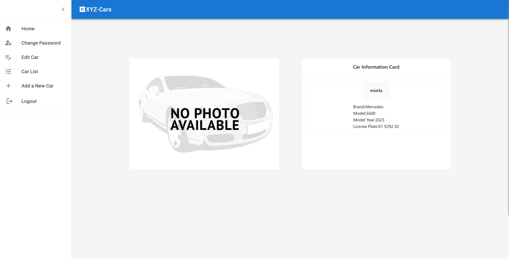

# car-registration-system
Patika bootcamp full stack project. In this porject you can able to register and login process. After login, you can able to see that car details, change password, add a new car, edit car etc... pages.
## Home Page

## After Login Home Page

## Register Page

## Login Page

## Login-Footer Page

## Car Detail Page

## Add Car Page

## Edit Car Page

## Change Password Page

